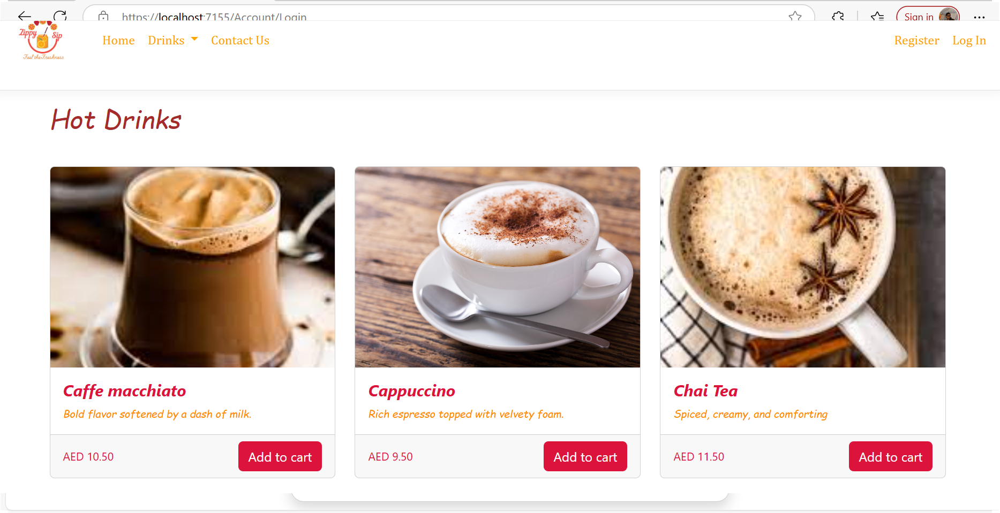
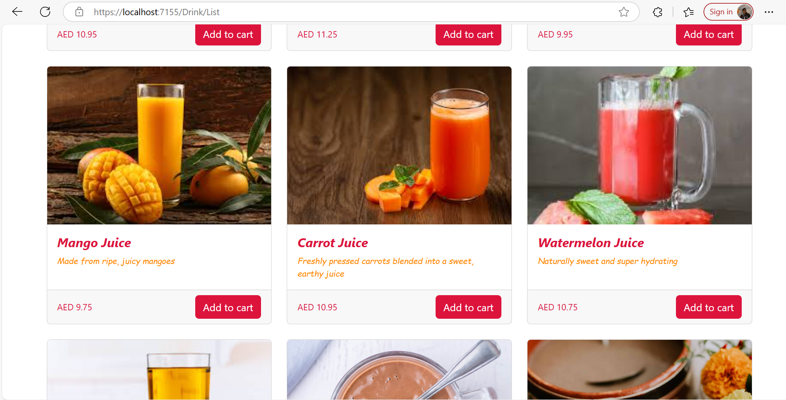
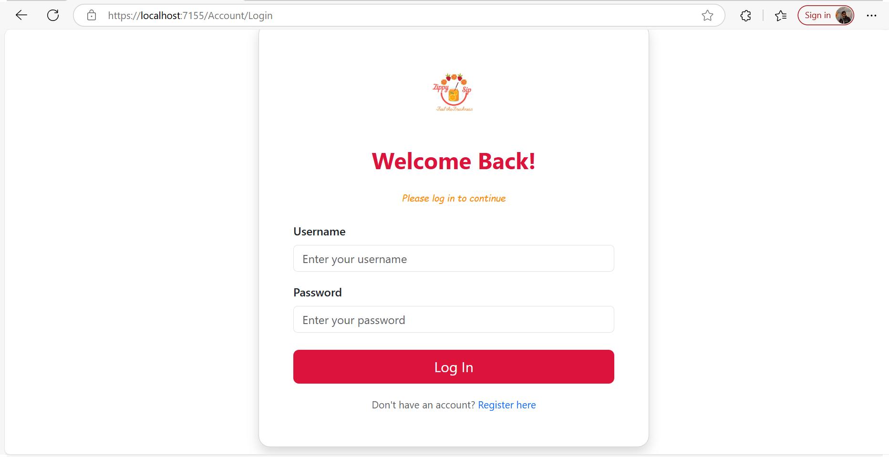

# ZippySip_App
Zippy Zip is an ASP.NET MVC web app for ordering juices, smoothies, and hot drinks. It offers a user-friendly interface, dynamic menus, and a smooth ordering process, allowing customers to browse and customize their favorite beverages easily.

## 📸 ScreenShots

## *🏠 Welcome Page – Explore Our Refreshing Drink Collection*

## *☕ Hot Drinks Menu – Browse Warm and Cozy Beverages*

## *🧃 All Drinks – Juices, Smoothies & More at a Glance*

## *🔐 User Login – Sign In to Order Your Favorites*

## *🛒 Shopping Cart – Review and Place Your Drink Orders*

## 🎥 Demo Video

https://youtu.be/Vvb7eJaRD3w

## 🚀 Features
👤 User registration, login, and authentication
🛒 Shopping cart with quantity adjustment and item removal
🔍 Product search, category filtering
🖼️ Responsive UI with Bootstrap 5
🗄️ Entity Framework Core 8 with Code-First Migrations

## 🛠️ Tech Stack
* ASP.NET Core 8 MVC
* C# and .NET 8 SDK
* Entity Framework Core
* SQL Server / LocalDB
* Bootstrap 5
* JavaScript / jQuery
* ASP.NET Identity

## 🧰 Getting Started
Prerequisites
* .NET 8 SDK
* SQL Server (Express or LocalDB)
* Visual Studio 2022+ or Visual Studio Code
* Installation
* Clone the repository
  https://github.com/sreeshmarajm/ZippySip_App.git

📬 Contact
    For questions, feedback, or collaboration: 
    
        GitHub: sreeshmarajm
        Email: sreeshmaraj101@gmail.com

